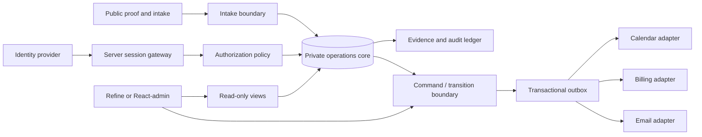
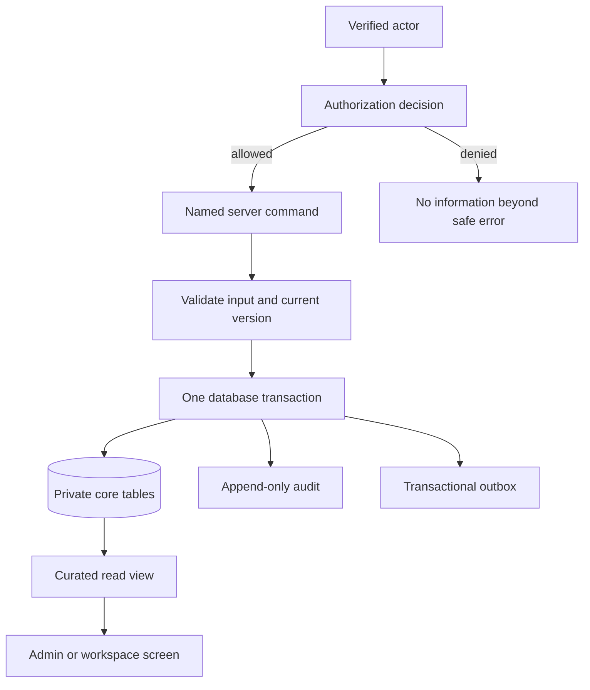

# Foundation architecture plan — authority platform, consulting operations, and future client workspace

- **Status:** Proposed — no service, repository, package, deployment, account, or data migration is authorized by this plan.
- **Scope:** one public authority site; one protected owner/staff operations surface; later, an invite-only client workspace. It does **not** create a public social network, broad self-service CRM, ERP, financial-advice system, or generic client portal.
- **Decision records:** [ADR-001](https://github.com/AbleVarghese/Consult-Able/blob/Portfolio-consult/docs/decisions/ADR-001-consulting-growth-architecture-2026-09.md) · [ADR-002](../decisions/ADR-002-admin-portal-foundation-2026-09.md) · [ADR-003](../decisions/ADR-003-identity-and-integration-foundation-2026-09.md) · [ADR-004 self-host direction](../decisions/ADR-004-self-hosted-authority-platform-2026-09.md).
- **Evidence scope:** [collection admission](../research/foundation-architecture-collection-admission-2026-09.md) · [candidate facts](../research/foundation-architecture-evidence-2026-09/github/candidate-facts.tsv) · [local reuse pointers](../research/foundation-architecture-evidence-2026-09/local-patterns.tsv).

## 1. Design objective

Build the smallest trustworthy operating spine that can grow from public proof to paid diagnostic, implementation, and a private client workspace **without making a CRM, identity platform, payment system, or evidence system from scratch**.

**Rule:** external tools may supply a capability, but the private operations core owns the platform’s truthful state. No external CRM, calendar, billing provider, identity service, or admin framework may become an unreviewed second source of truth.

## 2. What exists now versus what must wait

| Capability | Now | Trigger to add | Explicit non-goal now |
|---|---|---|---|
| Public authority site | Public-safe pages and proof from the current static-site source | Mac mini SSH/capacity/backup/restore gates pass | Visitor accounts, public dashboard, or intake that stores data |
| Operations | Owner/staff-only opportunity and evidence workflows | Synthetic data controls pass ADR-002 | Full CRM/ERP migration |
| Identity | No public account system; plan the provider seam | A protected staff operation actually exists | Social login, broad self-sign-up, enterprise SSO |
| Client workspace | Secure shared artifacts in client-approved tools | Repeated paid onboarding proves a workspace removes material friction | Multi-tenant portal before paid demand |
| Billing | Reference/reconciliation seam only | Contracted paid workflow requires it | Storing card/bank data or duplicating payment truth |
| Files | No uploads by default | Validated business need plus scanning/retention controls | Unbounded document vault |
| AI | No public assistant | Evidence quality and visibility controls pass | Uncited public answers or automatic advice |

## 3. Domain boundaries

A boundary is a place where a responsibility must not leak. Each module owns one job and exposes the smallest interface required by its neighbours.

| Module | Owns | Must not own | Interface to other modules |
|---|---|---|---|
| **Public proof** | Published wording, public-safe evidence references, search metadata | Private evidence, user accounts, operational notes | Read-only published claim view |
| **Intake** | Validated contact request, consent, source, stated problem | Opportunity-stage decisions, customer profile guessing | `submitIntake()` command |
| **Identity** | Authentication (who proved control of a sign-in method), session lifecycle, provider subject identifier | Business roles, client membership, commercial permissions | Verified `Actor` only |
| **Authorization** | Authorization (what the verified actor may do), role/grant evaluation, revocation | Passwords, OAuth tokens, payment state | `can(actor, action, resource)` decision |
| **Operations** | Opportunities, meetings, engagements, tasks, controlled state transitions | Raw payment processing, mutable evidence history | Named commands and read models |
| **Evidence** | Source, claim, approval, seal, expiry, supersession lineage | Generic contact management | Seal/supersede commands and verified public view |
| **Integration adapters** | Provider-specific request/response mapping, signature verification, idempotency keys | Business rule implementation or direct core-table writes | Inbound event → named command; outbox event → provider call |
| **Audit/outbox** | Append-only action history and durable delivery intent | User-facing application logic | Immutable event/read-only query |

### Stable identity contract

The database and business modules know only an immutable internal `actor_id`, provider name, provider subject identifier, session assurance level, and revocation state. They do **not** treat email, a raw JSON web token (JWT), or a provider role claim as business authorization. The `(provider, subject)` link is unique; matching email addresses never merge two accounts automatically.

This is deliberately smaller than a generic “identity abstraction.” A provider-specific server session gateway is sufficient until a real second provider is exercised. The durable internal actor contract is the migration seam; a conflicting account link goes through an audited staff-controlled recovery flow.

## 4. Authentication and authorization plan

### 4.1 Staged account policy

| Stage | Users | Entry rule | Access rule |
|---|---|---|---|
| 0 — public | Visitors | No account | Read public pages; submit a minimized intake form only |
| 1 — operations | Owner/staff | Allowlisted, multi-factor-authentication (MFA) protected account | Explicit role/grant; no generic admin role bypass |
| 2 — client workspace | Named client members | Invitation after a paid engagement and documented workspace need | Scoped to one engagement/organization; default deny |
| 3 — enterprise | Customer identity provider | Only after a paid requirement for SAML, SCIM, or enterprise single sign-on (SSO) | Separate architecture decision and integration test |

### 4.2 Candidate decision

The candidate screen found eight relevant open-source repositories. Licenses were read directly from their repositories; maintenance/security metadata is a signal, not a security certification.

| Candidate | Direct evidence | Disposition |
|---|---|---|
| **Supabase platform/Auth** | Apache-2.0 full platform; README documents optional self-hosting plus database, auth, generated APIs, realtime, storage, and dashboard capabilities | **Deferred full-platform alternative.** It adds more services than the public-first path currently needs. |
| **Better Auth** | MIT TypeScript framework; current Keralora source contains a Better Auth integration and hardened PostgreSQL wrapper pattern | **Self-host Stage 1 candidate.** It must prove clean integration with the protected database contract before use. Local source presence is not runtime validation. |
| **Auth.js** | ISC; its own README says new projects should start with Better Auth except for specific stateless-session gaps | **Do not start a new implementation here.** It is dominated by Better Auth for the stated default. |
| **Authelia** | Apache-2.0; reverse-proxy single-sign-on/MFA product; owner has a single-operator configuration pattern | **Perimeter-only reference.** Suitable to reassess for protecting an internal gateway, not the default customer/application identity core. |
| **Ory Kratos/Hydra** | Apache-2.0; full identity service; README describes an additional Hydra service for OAuth/OIDC provider behavior | **Deferred.** Reconsider only for real enterprise federation, machine identity, or cross-product identity needs. |
| **Keycloak** | Apache-2.0; mature full identity/access platform | **Deferred.** It solves a much larger identity-operations problem and adds a separate Java runtime. |
| **ZITADEL** | AGPL-3.0 in the direct license file | **Excluded by default license policy.** |
| **Logto** | MPL-2.0 in the direct license file | **Not admitted by the current permissive-license policy.** Requires a separate owner decision before any use. |

Managed-directory results also surfaced Supabase, Clerk, WorkOS, Auth0, and Neon. They are comparison inputs only. No provider was provisioned; managed identity sends identity data to a third party and needs separate owner approval at adoption time.

### 4.3 Chosen direction, pending self-host proof

ADR-004 refines the hosting direction after the owner rejected managed-service dependence:

1. Keep Stage 0 public and static; self-host the existing site directly behind Caddy only after the Mac mini access, capacity, backup, restore, and TLS gates pass.
2. Do not build visitor sign-up, storage, scheduling, analytics, CRM, or a client workspace at Stage 0.
3. When Stage 1 becomes real, test **Better Auth** with PostgreSQL and the same synthetic actor/session/authorization contract. Select exactly one identity issuer after the spike.
4. Treat the full self-hosted Supabase platform as a deferred alternative, not an initial data/identity dependency.
5. Defer Coolify until its health/backup/recovery path is observed; keep direct Compose source as deployment truth. Defer Authelia, Ory, and Keycloak until a measured requirement crosses their threshold.

The self-hosted matrix ranks the direct staged route first (**9.10**), wins **93.7%** of 10,000 seeded sensitivity worlds, and has the lowest maximum regret (**0.400**). Its promotion blocker is operational evidence, not another platform comparison: the current Mac mini SSH capacity probe timed out.

## 5. Private data and command model

The platform extends ADR-002 rather than creating a parallel data design.

Required properties:

1. Core tables remain in a non-exposed schema. Browser roles never receive broad table mutation privileges.
2. Every state-changing path uses a named command and an optimistic-lock revision token. Direct protected `PATCH`/`DELETE` requests must fail.
3. Sealed evidence is immutable. Corrections create one linked successor, never a second active branch.
4. The authorization decision is made in the command/database path and repeated in the server route. The screen is a convenience layer, not a security boundary.
5. Each command emits an append-only audit event and, when an external effect is needed, an outbox record in the same transaction.
6. Admin screens use curated views and commands; they do not receive a service-role secret. Any server-side privileged credential is isolated to one named outbox/reconciliation worker, never inherited by ordinary routes.

## 6. Integration plan

| Integration | External system owns | Platform owns | Boundary contract | Add only when |
|---|---|---|---|---|
| Calendar | Availability and booking event | Opportunity/meeting intent and follow-up state | Signed/validated booking event → idempotent `recordMeeting()` command | A real intake-to-booking test needs it |
| Billing | Invoice/payment state | Engagement state, billing reference, reconciliation result | Verified provider event → outbox/reconciliation command; no raw payment data | A paid offer has a selected billing flow |
| Email | Delivery attempt/status | Message intent, consent, template version, business outcome | Outbox → provider adapter; provider event → delivery receipt | Transactional communication becomes necessary |
| Private files | Object bytes | Artifact metadata, access grant, retention/expiry, scan status | Upload only through a validated, malware-scanned, access-controlled flow | Secure link/paste no longer satisfies a proven need |
| CRM/export | A future tool’s copy of selected records | Canonical opportunity/client/evidence data | Explicit export/import adapter with idempotency and reconciliation | Repeated work proves a CRM adds more than it costs |
| Analytics | Aggregated event processing | Consent, event definition, raw operational truth | Privacy-reviewed event adapter; no silent identity enrichment | A metric has a named decision owner |

**Universal adapter rules:** validate input at the boundary; verify each inbound webhook signature, timestamp, and replay/event identifier; apply an idempotency key; write through a command, never directly to a table; name outbound delivery as at-least-once; preserve a delivery/reconciliation receipt; and make retry state observable.

## 7. Repository admission gate

A repository is not “best” because it is popular. Before any candidate enters the future website repository, it must pass every gate below at a pinned version.

| Gate | Proof required | Reject when |
|---|---|---|
| Rights | Direct license text and SPDX align with the adoption policy | Copyleft/source-available/unclear terms enter the product path |
| Maintainer health | Recent release/activity, security reporting route, and dependency-update evidence where applicable | The project is abandoned, ambiguous, or its release policy is incompatible |
| Architecture | It fits the private-core and command-only model without a second source of truth | It needs broad client table access, service-role exposure, or its own authoritative CRM store |
| Security | Threat model, secret handling, session/revocation behavior, and negative controls are testable | Security depends on UI hiding, undocumented defaults, or untestable provider behavior |
| Operations | Upgrade, backup/restore, incident, and rollback path are known | A new runtime is added without an operator and recovery plan |
| Product fit | A real user/workflow needs the capability | It exists only because the future might need it |
| Integration | It has one bounded adapter and reconciliation behavior | It requires scattered provider calls across screens/routes |

## 8. Mandatory synthetic-data spike

Run in the actual website repository only. No production, prospect, client, résumé, or financial data is permitted.

| Test | Required success | Required failure proof |
|---|---|---|
| Identity/session | Allowed staff session produces a stable internal actor | Invalid, expired, revoked, or wrong-provider session is refused |
| Authorization | Authorized actor can use one named command | Same actor without grant cannot read or mutate another scope |
| Raw database/API | Curated view reads only allowed data | Authenticated raw `PATCH`/`DELETE` on protected records returns `401`/`403` |
| Evidence | Seal and supersede flow preserves a linear history | Direct mutation or second active successor fails |
| Concurrency | Current lock-version command succeeds | Stale concurrent command fails without changing data |
| Provider comparison | Supabase Auth and Better Auth both satisfy the same actor/command test fixture | Any provider requiring client-held privileged credentials or a second source of truth is rejected |
| Account link and assurance | One provider subject maps to one actor; MFA-qualified staff session is accepted | Same-email different subject cannot merge automatically; password-only/unverifiable assurance is refused |
| Recovery | Revocation/session failure has an observable safe outcome and owner-attended, time-bounded, audited recovery path | Simulated adapter/provider outage never grants access by fallback, creates a standing shadow provider, or leaves recovery undefined |

## 9. Rollout and kill criteria

| Stage | Promotion evidence | Stop/reverse condition |
|---|---|---|
| Public site | Real browser/accessibility checks; secure intake only | Any need for a public account is merely speculative |
| Staff operations | Every synthetic identity/data negative control passes | A direct mutation, role escalation, or untraceable state change succeeds |
| Client workspace | At least two paid engagements show repeated secure-workspace friction | Client-approved shared tools remain simpler or safer |
| Enterprise identity | A signed/paid requirement for SSO/SCIM or cross-product federation | Requirement is hypothetical or hosting/operations cost exceeds measured value |
| CRM/ERP | Repeated workflow and reconciliation evidence proves the external system wins | The system duplicates authoritative data or fails the rights/security gate |

## 10. What would change this plan

- The actual website repository uses a non-React/non-TypeScript or non-PostgreSQL stack.
- The Supabase Auth spike cannot enforce the ADR-002 protected-data contract.
- Better Auth passes the same contract materially more simply.
- A paid customer requires enterprise federation, and its value covers Ory/Keycloak-class operations.
- An owner-approved legal/privacy review makes a different identity or data-residency model mandatory.

## 11. Immediate execution order

1. Restore SSH access to the Mac mini and collect one fresh read-only capacity, running-service, backup, and restore snapshot.
2. Use the verified current static source repository (`AbleVarghese/AbleVarghese.github.io`) as the Stage 0 deployment input; do not treat this planning repository as application code.
3. Run the static-edge and synthetic backup/restore gates before any public self-host launch.
4. Reconcile the owner-provided `sources/2026-09/private/linkedin-profile-owner-provided-2026-09.pdf` with the GitHub profile evidence; the public LinkedIn profile remains blocked by its `robots.txt` and was not fetched. Locate the still-missing latest résumé before promoting résumé-dependent claims.
5. When a protected owner/staff workflow is real, create the synthetic private schema and run ADR-002’s database-boundary controls plus the Better Auth session/actor spike.
6. Record version/license/upgrade evidence for each admitted component, then add only the next proven module.
