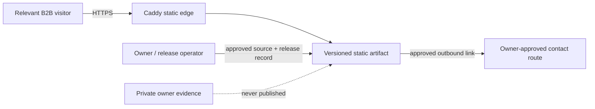
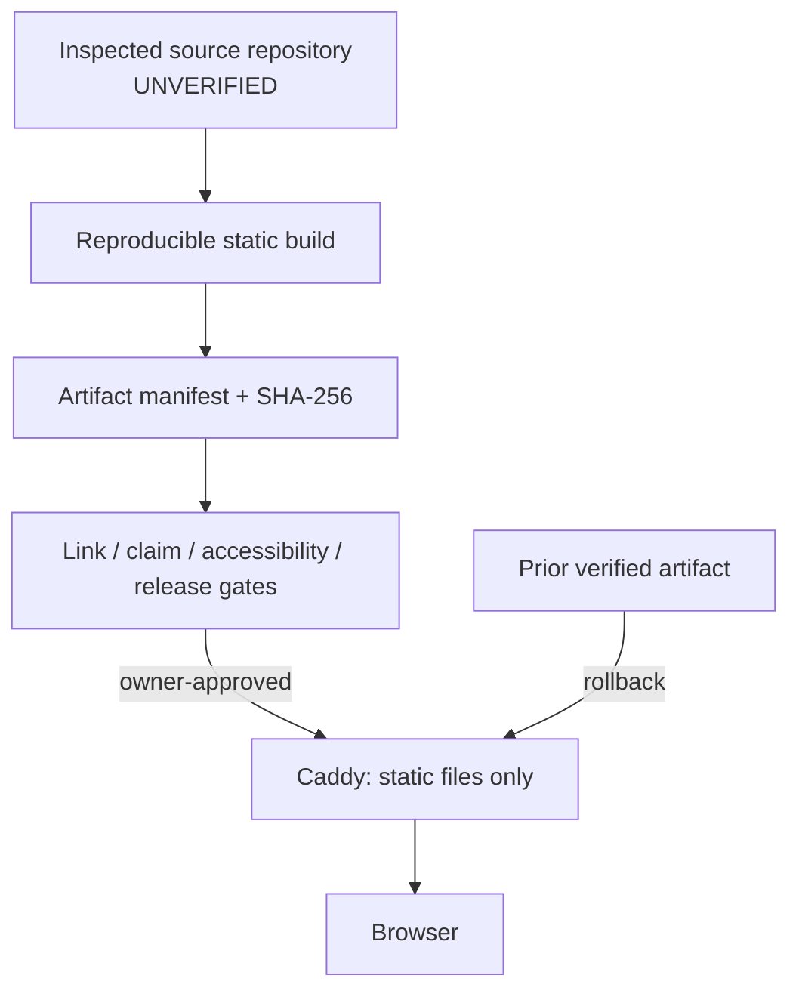
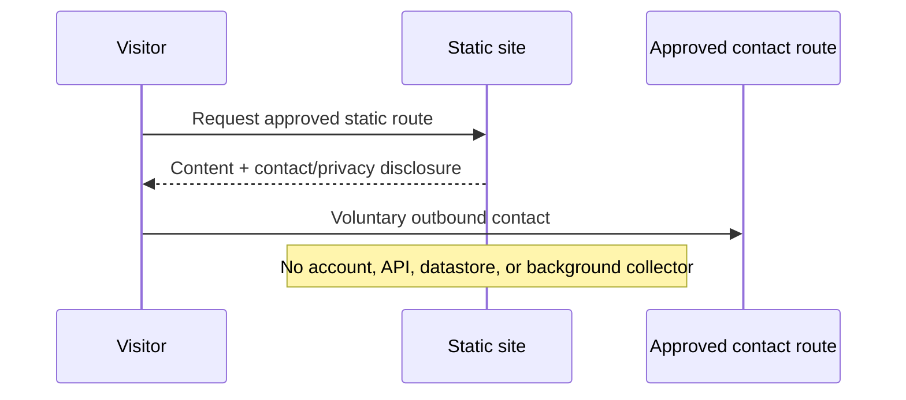

# Stage 0 architecture views · 2026-09

- **Status:** proposed. The diagrams describe the approved target boundary, not observed production state.
- **Decision source:** [ADR-004](../decisions/ADR-004-self-hosted-authority-platform-2026-09.md) proposes static Caddy hosting; DNS, certificate, Mini capacity, backup, and restore remain open gates.

## Context view

## Container view

## Deployment view

## Contact sequence

## Architecture invariants

| Invariant | Evidence required before release |
|---|---|
| Static-only public boundary | Route/network/storage inspection (VT-10). |
| Claim/proof boundary | Approval/provenance review and missing-approval negative control (VT-03/04). |
| Reversible delivery | Source/artifact digest, prior artifact, rollback drill (VT-02/08). |
| Private evidence isolation | Rendered artifact and source review show no private PDF/content (VT-03). |
| No assumed infrastructure | Read-only Mini/DNS/TLS/backup/restore gate evidence. |
