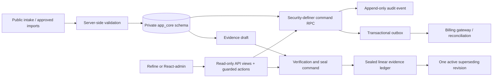
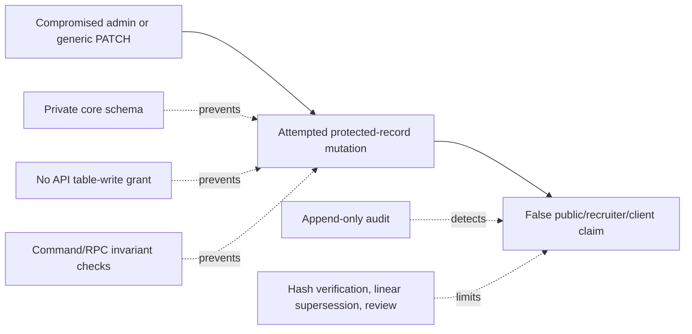

# ADR-002: Preserve a guarded canonical data core; select the admin UI by spike

- **Status:** Proposed · amended after independent red-team challenge · 2026-09-23
- **Decision type:** Type 1 architecture and dependency-adoption direction; no repository, package, service, or deployment is adopted by this record.
- **Evidence:** [`crm-erp-admin-portal-landscape-2026-09.md`](../research/crm-erp-admin-portal-landscape-2026-09.md) · active [matrix JSON](admin-portal-active-foundation-matrix-2026-09.json) and deterministic [output](admin-portal-active-foundation-matrix-2026-09.output.txt) · primary GitHub evidence beside the research study.

## Context

The original website blueprint proposes a professional evidence graph, Recruit/Consult/Build opportunity flows, and an admin model containing contacts, opportunities, evidence, résumé versions, meetings, research, case studies, email templates, and analytics. Its proposed architecture is Next.js/TypeScript with PostgreSQL/Supabase, MFA for administration, row-level security (RLS), and “Supabase first; optional HubSpot sync.” That is `[reported]` design input, not a live implementation in this repository.

The owner asked that a lightweight customer-relationship-management (CRM), enterprise-resource-planning (ERP), or admin-portal foundation be compared deeply rather than reinvented. Public GitHub research examined 218 unique candidate metadata records, direct licenses, direct README/release/maintenance metadata for finalists, public owner repositories, and the owner’s project profile. The current website repository contains no application implementation to integrate or test.

The root problem is **not** a missing generic CRM. It is a need for one truthful, protected operational view over evidence, career opportunities, B2B engagements, expert sessions, and client delivery without duplicating the canonical data model or allowing generic editing to corrupt provenance.

## Decision

1. **Do not adopt a full CRM or ERP now.** ERPNext, Odoo, and conventional CRM suites are reference systems, not the default foundation for the first operational workflow.
2. **Keep PostgreSQL/Supabase as the proposed canonical data core** unless the eventual website implementation proves a different database boundary is required. An admin framework is a view/control layer, never the source of truth.
3. **Build database controls before admin screens.** The data model must separate mutable operational records from sealed provenance/evidence records and financial references.
4. **Select between Refine and React-admin through the same guarded integration spike.** Both are direct-source MIT TypeScript/React candidates. The spike, not metadata or star counts, selects the UI framework.
5. **Treat AdminJS as a non-winning comparison candidate.** It is MIT and Node-native, but the active matrix marks it dominated by the two React frameworks under the current assumptions.
6. **Defer separate-runtime systems** (Appsmith, Baserow OSE, Corteza, Krayin) until repeated workflows prove that their extra runtime and integration boundary buy more value than they cost.
7. **Exclude ToolJet, Twenty, EspoCRM, SuiteCRM, Dolibarr, ERPNext, Budibase, Invoice Ninja, and NocoBase from default adoption** under the owner’s license policy. Odoo is only eligible as an unmodified isolated LGPL process if separately justified and approved.

## Architecture contract

### Data classes and permitted mutation

| Data class | Examples | Mutation rule |
|---|---|---|
| Mutable operations | contact details, intake notes, meeting details, draft opportunity | Versioned update with optimistic-lock check |
| Guarded process state | qualification, proposal, engagement, close/loss state | No raw update; a named server-side procedure validates the allowed next state and checklist |
| Sealed provenance/evidence | source hash, visibility approval, verification decision, immutable artifact reference | Draft may change; sealed item rejects update/delete; correction creates a linked superseding record |
| Audit | who/what/when/why for a controlled action | Append-only; never edited in place |
| Billing reference | external invoice/payment identifier, status, reconciliation result | No card/bank secrets; changes reconcile through an explicit integration seam, not a CRM status field |
| Financial coaching/investing data | any suitability, advice, account, trade, or client financial detail | Out of scope until jurisdiction, product boundary, legal review, retention, and access controls are separately accepted |

### Mandatory database/UI invariants

1. Core tables live in a **non-exposed private schema** such as `app_core`; browser roles receive no direct `INSERT`, `UPDATE`, or `DELETE` grants on those tables.
2. The exposed API contains only curated, read-only views and narrowly granted command functions. A valid authenticated JSON web token (JWT) must still receive `401`/`403` on raw `PATCH`/`DELETE` attempts against protected resources.
3. A sealed evidence record rejects direct `UPDATE` and `DELETE` at the database boundary. A correction creates a new revision with a `supersedes` relationship.
4. Evidence lineage has a single active successor: a database uniqueness rule prevents two concurrent revisions from becoming active children of the same sealed record.
5. Opportunity-stage changes call named procedures such as `advance_opportunity_stage`; UI dropdowns never write the stage column directly. A procedure validates actor, current state, allowed next state, checklist, and revision token in one transaction.
6. All mutable writes include `lock_version` (or an equivalent revision token) and fail on stale writes.
7. Admin frameworks receive curated read views and controlled commands. They do not receive service-role credentials or ambient table-write authority.
8. Authorization is enforced in database policy/procedure boundaries, then repeated in the server route; client-side visibility is not authorization. Privileged command functions have a narrowly controlled owner, fixed search path, explicit executable roles, and audited input validation.
9. Lists use purpose-built views, pagination, filters, and bounded relation loading to avoid accidental expensive RLS joins. Partition an append-only audit table only after measured volume/query evidence justifies it.
10. State transition and corresponding billing/outbox event commit atomically. A delivery worker is idempotent, records attempts, and reconciliation reports any mismatch; no card/bank secrets enter the portal database.

## Alternatives and screening

| Candidate/family | Primary direct evidence | Result | Reason |
|---|---|---|---|
| Native data + custom admin | Existing blueprint’s Supabase-first canonical model | Finalist | Best control and source-of-truth fit; slower UI delivery |
| Refine | MIT source; TypeScript/React; direct README documents auth/access/routing/data-provider patterns; 13 public workflows | Finalist | Strong match for a guarded custom admin UI; requires a safe data provider rather than generic CRUD |
| React-admin | MIT source; TypeScript/React REST/GraphQL framework; direct README documents roles/permissions/data providers; 7 public workflows | Finalist | Strong equivalent candidate; must pass the same guarded-data test |
| AdminJS | MIT source; Node automatic admin interface/custom actions; one public workflow | Eliminated in active matrix | Less direct fit than the React finalists under current architecture assumptions |
| Appsmith | Apache-2.0; Docker/Kubernetes deployment documented | Deferred | Separate large runtime; reconsider if later workflow volume justifies an internal-tool service |
| Baserow OSE | Direct license grants MIT outside premium/enterprise restrictions; Docker/PostgreSQL documented | Deferred | Viable data/app reference, but a second platform can create source-of-truth drift |
| Corteza | Apache-2.0; CRM/process/RBAC/privacy automation documented | Deferred | Broad Go platform before a proven need for that complexity |
| Krayin | MIT; Laravel/Vue/MySQL/MariaDB; direct README says 3 GB+ RAM | Deferred | Separate PHP/MySQL runtime and generic CRM model |
| ERPNext / owner `erpnext-Abled` fork | Direct GPL-3.0 source; upstream covers accounting, inventory, manufacturing, assets, projects | Default exclusion | License policy and scope mismatch; owner repository is an upstream fork |
| ToolJet/Twenty/EspoCRM/SuiteCRM/Dolibarr/Budibase/Invoice Ninja/NocoBase | Direct AGPL/GPL/BSL/ELv2/custom-license sources | Default exclusion | Rights/ownership gate fails or needs a separate owner-approved isolated-service exception |

## Solvemax comparison

The full landscape matrix initially made “native data first, Refine after spike” the 9.09 leader but showed it was statistically fragile against immediate Refine adoption (48.8% simulated win rate). The near tie was composable, so it was replaced by the active decision question: **how to stage a guarded core before choosing a framework**.

The active matrix selected **H — Control-first, then two-framework spike**:

| Result | Evidence |
|---|---|
| Weighted score | 9.28 vs. 8.85 native-only runner-up |
| Merit and context winner | H on both quality and owner-fit axes |
| AHP consistency | CR 0.000; consistency check only, not independent customer evidence |
| Monte Carlo result | Fragile: H wins 59.5% of 10,000 seeded worlds; Refine 13.8%, React-admin 14.2%, native-only 10.1% |
| Regret cross-check | H has lowest maximum weighted regret (0.150) |
| Consequence | The process choice is stronger than a premature framework winner; a real spike is mandatory |

## Red-team amendments

The first independent challenge returned **CHALLENGED_WITH_FLAWS**; its valid evidence-integrity and state-machine findings were added. The amended proposal was challenged again and returned **CHALLENGED_WITH_FLAWS** for ambient API authority, revision branching, and asynchronous billing drift. The controls below are mandatory promotion blockers, not UI conventions.

| Attack | RPN | Required mitigation |
|---|---:|---|
| Generic CRUD mutates a sealed proof hash or artifact URL | 9×5×7 = 315 | Draft/seal states, private core schema, no public table-write grant, WORM trigger/policy, append-only audit, superseding correction model |
| Authenticated token bypasses transition RPC through direct PostgREST mutation | 9×5×7 = 315 | Non-exposed core tables, read-only API views, command-only mutations, raw-endpoint `401`/`403` negative control |
| Two corrections fork a sealed evidence lineage | 8×4×8 = 256 | Single-active-successor database uniqueness rule and transaction retry/conflict behavior |
| Operator jumps an opportunity to a forbidden state | 8×6×6 = 288 | Named transition procedure, allowed-transition map, prerequisite checks, no raw state-column update |
| Stale browser save overwrites another operator’s decision | 7×6×7 = 294 | `lock_version` conditional update and conflict UI; test two concurrent saves |
| Separate financial/retainer state drifts from billing reality | 8×4×7 = 224 | Transactional outbox written with state transition, idempotent delivery, and periodic reconciliation report |
| Multiple foreign runtimes create operating/authentication sprawl | 7×6×6 = 252 | Active matrix contains only native/TypeScript/React candidates; separate platforms are deferred references |
| RLS relation-heavy list exhausts a connection pool | 7×4×6 = 168 | Curated, paginated admin read views; query-plan/load test before release; partition only when measured need exists |

### Bowtie: protected evidence mutation

## Council: five-lens review

| Lens | Finding | Decision effect |
|---|---|---|
| Contrarian | A CRM UI can create a false sense of control while silently weakening evidence integrity | Control boundaries precede UI choice |
| First-principles | The need is a trusted operational view over custom entities, not a generic sales suite | Keep one canonical schema and choose a thin view layer |
| Expansionist | A correct evidence/opportunity ledger can compound into recruiter, agency, product, and client workflows | Preserve the data core and reusable policy layer |
| Outsider | Full ERP features solve inventory/accounting/manufacturing problems absent from this platform | Reject scope-driven complexity |
| Executor | Two small UI spikes against the same synthetic schema are cheaper than adopting a large suite | Use Refine and React-admin only after invariants exist |

**Chairman:** select the staged control-first path; do not select Refine, React-admin, or any CRM by metadata alone.

## Required spike and acceptance tests

Run only inside the eventual website repository, against synthetic data and an isolated development database. No production/prospect/client data is permitted.

| Test | Positive proof | Negative control |
|---|---|---|
| Sealed evidence | Approved seal creates immutable hash/reference | Direct hash/URL update and delete are rejected |
| Raw API authority | Curated view reads work for the authorized role | Authenticated browser token gets `401`/`403` for raw `PATCH`/`DELETE` to protected core entities |
| Supersession | Correction creates one linked active revision | A concurrent second child of the same sealed parent fails without changing the first lineage |
| State machine | Allowed stage change succeeds through a command | Direct jump to a disallowed state is rejected |
| Concurrency | Current revision update succeeds | Stale `lock_version` update fails visibly without changing data |
| Authorization | Authorized role sees/use only its permitted command/view | Unauthorized role cannot enumerate or mutate protected records |
| Billing outbox | State change and outbox record commit together; idempotent delivery reconciles | Simulated delivery failure remains visible/retryable and cannot silently green a paid state |
| Framework parity | Refine and React-admin each complete the same approved read/action flows | Any framework requiring raw table PATCH/DELETE on protected entities is rejected |

## Profile evidence policy

| Source | Use now | Limit |
|---|---|---|
| Public GitHub profile and project README | Current project narrative, links, and publicly declared capability areas | Public self-description, not independent verification of every metric or private codebase claim |
| Exact LinkedIn profile URL | Identified from owner GitHub social metadata | The target page was not fetched: LinkedIn’s 2026-09 `robots.txt` disallows generic-agent access to that path; owner-provided export/PDF/text is required |
| Latest résumé | Owner states it contains latest Interac-role detail | File absent from repository; source must arrive through an approved non-restricted path |
| Trading/investing experience | Owner reports ten years; local workbook reports an earlier trading role | Neither fact authorizes investment advice or becomes public proof without source/permission/legal review |

## Consequences

**Positive:** avoids reinventing generic admin primitives while keeping custom domain truth, privacy, and evidence controls in one place.

**Accepted cost:** the first admin path is slower than installing a full CRM/ERP, because an unguarded generic UI would make the evidence system less trustworthy.

**Deferred cost:** separate low-code/CRM suites remain options only if measured workflow repetition proves they are cheaper and safer than the bounded custom core.

## Assumptions and tripwires

| Assumption | Tripwire | Action |
|---|---|---|
| The site will use a React/TypeScript-compatible stack | Actual website repository uses another runtime | Re-run active candidate screen before any package choice |
| Supabase/PostgreSQL is acceptable as canonical data storage | Security, data-residency, or product architecture rejects it | Re-evaluate data core before UI work |
| Refine/React-admin can use command-only flows for protected resources | Spike needs generic raw mutation to work | Reject the framework/configuration |
| Financial coaching remains legally separate | Scope requires customer financial data/advice workflow | Stop and perform dedicated legal/product/security decision analysis |

## Kill criteria

1. Any candidate requires broad direct mutation of sealed evidence or guarded-state tables → reject it.
2. Any candidate introduces a second authoritative store for contacts/opportunities/evidence without a tested reconciliation contract → reject it.
3. Any spike fails a listed negative control → do not promote the UI framework; fix the data boundary first.
4. A licence/source inspection finds copyleft, source-available, commercial, or changed terms outside the allowed adoption policy → reject or seek explicit owner-approved isolated-service exception.

## Predicted outcome and review

**Prediction:** once an actual website repository exists, the same guarded synthetic-data spike will eliminate at least one of Refine or React-admin and leave a verified admin foundation without adopting a full CRM/ERP.

**Review trigger:** before the first admin dependency is installed or any prospect/client data enters the system. Re-run this ADR with spike evidence and a fresh dependency/security review.

## Verification status

**UNRESOLVED CRUX:** two challenge calls returned substantive flaws and strengthened the data-boundary contract. A third challenge call returned only a receipt, not a confirmation; it is not counted as validation. Refine versus React-admin cannot be truthfully selected until both exercise the hardened private-schema, command-only path and every listed negative control. No candidate is adopted by this ADR.
