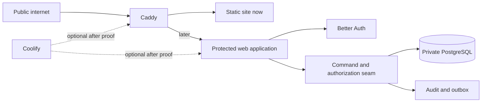

# ADR-004: Stage a direct self-hosted authority platform on the owner server

- **Status:** Proposed — research decision only. It authorizes no package, service, deployment, account, migration, DNS change, or data transfer.
- **Decision type:** Type 1 architecture with a reversible first stage.
- **Related records:** [ADR-002](ADR-002-admin-portal-foundation-2026-09.md) · [ADR-003](ADR-003-identity-and-integration-foundation-2026-09.md) · [self-host research](../research/self-hosted-authority-platform-research-2026-09.md) · [matrix output](self-hosted-authority-platform-matrix-2026-09.output.txt).

## Context

The owner rejects managed application, database, and identity-service dependence and has an owner-controlled Mac mini intended for hosting. The present site source is a small static HTML repository (`AbleVarghese/AbleVarghese.github.io`), while this planning repository contains no executable website application. The current Mac mini peer reports online, but the one bounded SSH probe timed out; capacity, backups, running services, and deployment health are unverified.

The problem is therefore **not** “which complete platform should replace SaaS.” It is: how to own the public site now, then add protected operations later without creating a full platform, a second source of truth, or a new unmanaged operations burden.

## Decision

Adopt the following staged direction, pending every proof gate below:

1. **Stage 0:** self-host the existing static professional site behind Caddy through a source-controlled direct deployment topology. Keep it account-free and data-minimal.
2. **Stage 1:** only when a real owner/staff workflow needs protection, add one server-rendered TypeScript application with Better Auth, PostgreSQL, and Drizzle behind the same Caddy edge.
3. Keep private operational/evidence tables behind named commands, authorization checks, optimistic concurrency, append-only audit, and transactional outbox controls from ADR-002/003.
4. Treat Coolify as an **optional deployment adapter**, never as the application’s source of truth. It enters only after its current health, backup, restore, and resource evidence passes.
5. Defer Supabase’s full self-hosted platform, Keycloak, Ory, Umami, file storage, scheduling, mail, search, and a client workspace until measured workflow evidence requires each capability.

## Locked decision criteria

| Criterion | Weight | Type | Why it matters |
|---|---:|---|---|
| Sovereignty and egress | 25% | Quality | Application and identity state stay owner-controlled |
| Private-core control | 25% | Quality | UI/framework convenience cannot bypass authorization or canonical state |
| Operational burden | 20% | Fit | The owner operates one constrained server; avoid unnecessary runtimes |
| Scope and time to value | 15% | Quality | The static site exists today; protected capabilities need proof before build |
| Maintenance evidence | 10% | Quality | A popular repository is insufficient without active upstream/release evidence |
| Reversibility | 5% | Fit | A small server needs a low-cost escape route |

The direct staged topology scores **9.10**, wins **93.7%** of 10,000 seeded sensitivity worlds, and minimizes maximum regret at **0.400**. The AHP consistency ratio is **0.000**. The direct Compose route beats the Coolify-led variant because it retains the same application seam with one less required control plane.

## Alternatives considered

| Alternative | Why it lost |
|---|---|
| GitHub Pages status quo | Managed hosting conflicts with the owner’s stated direction and is dominated by self-hosted static delivery |
| Static Caddy only | Best immediate hosting move, but cannot become protected operations without a later architecture addition |
| Coolify-led lean stack | Same data/control design is viable, but current Mini health and restore evidence are absent; an extra control plane adds operational surface |
| Full self-hosted Supabase | Apache-2.0 and self-hostable, yet brings database, auth, generated APIs, realtime, storage, and dashboard capabilities before evidence requires them |
| Keycloak | Mature Apache-2.0 identity platform, but a separate broad identity runtime is disproportionate without enterprise federation demand |
| Ory Kratos/Hydra | Mature Apache-2.0 identity path, but its multi-service federation capability exceeds the current public-first requirement |

## Non-negotiable boundaries

1. No managed application, database, authentication, analytics, storage, CRM, booking, or email service enters this topology by default.
2. Public DNS and a public certificate authority are the only assumed external trust dependencies for browser-trusted HTTPS. If the owner rejects those too, public HTTPS is not feasible; restrict the site to a private network instead.
3. Caddy routes; it does not authorize business actions. Better Auth authenticates; it does not decide business permissions. PostgreSQL commands decide authorization and state transitions.
4. Browser code receives no provider secret, service-role credential, or broad direct database write privilege.
5. Provider-subject identity links are unique. Email similarity never silently merges accounts.
6. Any privileged worker has one named outbox/reconciliation duty. Ordinary application routes do not inherit it.
7. Compose source remains the deployment truth even if Coolify is later admitted.

## Council: Tier 1 inline review

| Advisor | Finding | Effect |
|---|---|---|
| Contrarian | A self-hosted server turns patching, recovery, and hardware failure into owner work | No launch before restore drill, update routine, monitoring, and outage posture exist |
| First-principles | A static public page needs no database, account, or platform | Start with static Caddy delivery only |
| Expansionist | A stable actor and command seam can later add a client workspace without rewriting evidence/operations records | Reserve the private-core contract; delay its implementation |
| Outsider | Full identity platforms solve federation rather than this site’s immediate public-proof job | Defer Keycloak/Ory/Supabase full platform |
| Executor | SSH is currently the first broken prerequisite, not a deployment detail | Restore read-only server access before any deployment design becomes execution work |

| Anonymized peer review | Challenge accepted into the decision |
|---|---|
| A | “Self-hosted” can hide a single-host outage; backup recovery needs an observed restore, not an intent. |
| B | The staged path can grow into a speculative application; hard-trigger Stage 1 on a real protected workflow. |
| C | A deployment console can become an opaque source of configuration drift; preserve direct Compose as the seam. |
| D | Direct database access can quietly defeat auth; enforce command-only writes and raw-mutation negative tests. |
| E | HTTPS still uses public trust infrastructure; state the certificate/DNS exception rather than claiming total isolation. |

**Chairman:** choose the direct staged route. The accepted trade-off is slower feature accumulation in exchange for less operational surface, less data egress, and a clean reversal path.

## Internal adversarial review

The `red_team_challenge` tool was invoked with a sanitized topology brief. It returned a receipt only, with no substantive verdict. It does **not** independently certify this ADR. The following internal FMEA remains active until an independent substantive review arrives.

| Attack | RPN | Required mitigation |
|---|---:|---|
| Single Mac mini failure loses or exposes operational data | 9×4×7 = 252 | Encrypted backup, isolated restore drill, outage runbook, health/space monitoring, and no launch before evidence exists |
| Unpatched self-hosted auth/application dependency is exploited | 9×4×7 = 252 | Pinned versions, dependency/security scan, scheduled update review, staging rollback, and a visible patch receipt |
| Coolify or an ad-hoc deploy becomes configuration truth outside source review | 8×4×7 = 224 | Direct Compose and environment contract remain source-controlled; Coolify is optional and compared against the source contract |
| Container workload starves PostgreSQL on an unmeasured Mini | 8×5×6 = 240 | Read-only capacity snapshot, Compose CPU/memory limits, database health check, and load/restart negative control |
| Browser-trusted TLS silently expires or routes a wrong host | 7×3×6 = 126 | Certificate/host monitoring and an exact bad-host/certificate negative test |
| Identity recovery becomes a permanent bypass | 9×3×8 = 216 | Owner-attended, time-bounded, audited recovery with no generic database bypass |

### Critical-flow deviation checks

| Flow | Deviation | Guard |
|---|---|---|
| Static deploy | Partial artifact or wrong host | Pinned artifact digest, health check, atomic switch, and rollback receipt |
| Protected command | Revoked/stale/wrong subject session | Recheck actor, grant, assurance, and revocation at the command/database seam |
| Backup restore | No backup, stale backup, or incomplete restore | Scheduled backup outcome plus isolated synthetic restore/read-back proof |

## Assumptions and tripwires

| Assumption | Confidence | Tripwire | Action |
|---|---:|---|---|
| “No managed services” permits public DNS and certificate issuance | 75% | Owner rejects either dependency | Restrict to private-network hosting or obtain a revised owner decision |
| The Mini can host the Stage 0 edge safely | 40% | SSH health/capacity probe fails or shows insufficient headroom | Stop; repair/resize the hosting path before deployment |
| Better Auth can satisfy the private-core contract | 60% | Synthetic session/authorization/raw-write test fails | Reject it; re-open the identity decision |
| PostgreSQL license is admissible under the owner policy | 70% | Policy owner rejects direct license classification | Stop and select a policy-admissible store before adoption |

## Kill criteria

1. **Before launch:** a synthetic backup cannot restore and produce the expected read-back in an isolated database → do not deploy persistent operations.
2. **Before protected access:** any raw authenticated protected-table/API `PATCH` or `DELETE` succeeds in the synthetic spike → reject the implementation.
3. **At any stage:** a 24-hour update/health/backup receipt is missing for two consecutive scheduled checks → freeze expansion and repair operations first.
4. **At any stage:** server resource pressure causes the database health check to fail during one controlled application restart → reduce the topology or move hosting after owner review.

## Predicted outcome and review

**Prediction:** within 30 days of restored SSH access, a synthetic static-edge and backup/restore proof will either establish a safe Stage 0 launch path or rule out the current Mac mini as ready. No client or identity data will be needed for that test.

**Review date:** 2026-10-23, or immediately when SSH access and a read-only capacity snapshot are available.

## What would reverse this decision

A measured requirement for realtime/storage/generated APIs, paid enterprise federation, a different actual web runtime, a failed Better Auth private-core spike, an unacceptable PostgreSQL license classification, or server capacity/restore evidence that makes direct hosting unsafe.
