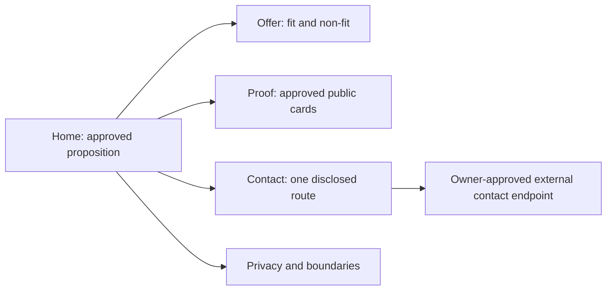

# Technical design specification — Stage 0 public authority site · 2026-09

- **Status:** proposed. This is a content and release design, not permission to build or deploy.
- **Inputs:** [PRD](../requirements/PRD-STAGE-0-PUBLIC-AUTHORITY-SITE-2026-09.md) · [SRD](../requirements/SRD-STAGE-0-PUBLIC-AUTHORITY-SITE-2026-09.md) · [architecture views](../architecture/STAGE-0-ARCHITECTURE-VIEWS-2026-09.md).

## Content model

| Surface | Required fields | Control |
|---|---|---|
| Offer | approved proposition ID, audience, scope, non-fit, review date | No render without matching approval row. |
| Proof card | claim ID, public source URL, disclosure/status, review date | Private sources prohibited; stale/unknown status blocks release review. |
| Contact | approved route, purpose, recipient, data boundary | Exactly one minimal route; no hidden form/collector. |
| Privacy | collection boundary, external-route disclosure, update date | No generic privacy promise beyond measured behavior. |
| Release record | source SHA, artifact SHA, operator, approval, read-back, rollback target | Immutable append-only record for each candidate/release. |

## Route and interaction design



- Navigation is semantic HTML first; JavaScript is optional enhancement, not required for content, contact disclosure, or keyboard navigation.
- Motion is decorative only and honors `prefers-reduced-motion`.
- Outbound links identify their destination before activation; no embedded third-party widget is authorized at Stage 0.

## Deterministic release design

```text
approved source + approved claim rows
  -> static build -> artifact digest/manifest -> validation gates
  -> owner release approval -> Caddy static serve -> independent read-back
  -> retain prior verified artifact for rollback
```

The repository, build command, static framework, and Caddy configuration are **UNVERIFIED** until the actual source worktree and host gates are inspected. This specification intentionally does not invent their implementation details.

## Accessibility and safety design

Use one H1 per route, ordered headings, visible focus, native controls, descriptive link text, text alternatives, responsive reflow, and reduced-motion behavior. Validate the rendered artifact rather than declaring conformance from source inspection. No credential, private PDF, analytics tag, account UI, or persistence layer belongs in this design.
