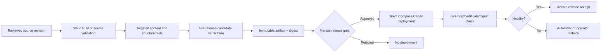

# Stage 0 CI/CD plan — source-controlled static release · 2026-09

- **Status:** proposed. There is no selected runner, pipeline provider, secret, or deployment target in this plan.
- **Goal:** make a static-site release reproducible, reviewable, and fail-closed without treating a deployment console as source of truth.
- **Inputs:** [implementation plan](STAGE-0-IMPLEMENTATION-PLAN-2026-09.md) · [verification plan](STAGE-0-VERIFICATION-PLAN-2026-09.md) · [ADR-004](../decisions/ADR-004-self-hosted-authority-platform-2026-09.md).

## Admission gate before pipeline design

| Fact to measure | Why it matters | No-evidence action |
|---|---|---|
| Actual site repository, branch policy, and existing checks | A pipeline must extend the real source, not invent a parallel one | Stop before creating CI files |
| Mini SSH, disk/RAM/CPU, Docker/Compose, backup, and runner state | The runner/deploy host may be unavailable or unsafe | Keep verification local only |
| Current secret/configuration boundary | Static deploy credentials must not leak into source or logs | Do not add secret references |
| Artifact destination and rollback mechanism | “Deploy” is meaningless without an atomic target and previous version | Do not automate release |

## Candidate pipeline contract

| Pipeline stage | Must prove | Must refuse |
|---|---|---|
| Source integrity | Clean intended diff, approved copy identifiers, no secret material | Unreviewed/blocked claims or unrelated changes |
| Build/validation | Static output is reproducible from the checked revision | Missing asset, unresolved local link, failed targeted test |
| Release candidate | Accessibility/privacy/content/asset checks pass | Skipped check, unavailable required check, or unrecorded warning |
| Artifact | One immutable, hashed deployable output exists | Mutable working tree or an artifact without manifest/digest |
| Release gate | Owner/authorized operator approves exactly one artifact | Auto-release based only on a branch update |
| Post-release | Host, TLS, route, and served digest match the candidate | Health check failure, wrong host/certificate, or digest mismatch |

## CI/CD boundaries

1. The direct Compose declaration is the deployment truth; a future dashboard may observe or invoke it but may not become an unreviewed second configuration source.
2. CI receives the minimum credential needed to publish the already-hashed static artifact. It never receives private evidence sources, broad database access, or application service credentials.
3. No source code, build artifact, or secret may be sent to a newly chosen external CI provider without the owner’s separate authorization.
4. Pipeline changes require the same observed RED/GREEN and negative-control evidence as site changes.
5. A missing runner, unavailable Mini, or unreadable deployment state is `UNKNOWN`, not a green skip.

## Completion evidence

A CI/CD implementation is not complete until one controlled candidate passes the pipeline, one planted failure blocks it, one release succeeds, one post-release read-back matches the artifact digest, and one rollback is observed. Until then this is a plan, not an active delivery lane.
