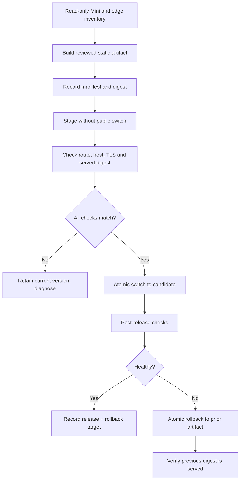

# Stage 0 deployment and rollback plan — direct static edge · 2026-09

- **Status:** proposed; execution blocked until the Mini and public-trust gates are evidenced.
- **Goal:** publish one reviewed static artifact through the direct Caddy/Compose topology selected by ADR-004, with a tested way back.
- **Authority:** [ADR-004](../decisions/ADR-004-self-hosted-authority-platform-2026-09.md) · [CI/CD plan](STAGE-0-CI-CD-PLAN-2026-09.md) · [open decisions](https://github.com/AbleVarghese/Consult-Able/blob/Portfolio-consult/docs/OPEN-DECISIONS-REGISTER.md).

## Release prerequisites

| Gate | Required proof | If it fails |
|---|---|---|
| OD-06 external trust decision | Owner accepts named DNS/certificate-authority scope, or explicitly chooses private-only access | Do not expose a public HTTPS site |
| OD-07 Mini access | Read-only SSH succeeds from the laptop | Do not infer capacity or alter the server |
| Capacity | Disk, RAM, CPU, Docker/Compose, existing listeners, and resource limits are measured | Stop or reduce the topology before deployment |
| Recovery | Backup is current and an isolated restore/read-back succeeds | Do not deploy persistent operational components; static release still needs a rollback artifact |
| Edge | Caddy configuration, intended host, port, certificate flow, and static root are reviewed | Do not change DNS or start a public listener |
| Candidate artifact | Approved source revision and immutable digest exist | Do not deploy a working directory |

## Controlled release sequence

## Rollback contract

| Failure | Immediate action | Verification |
|---|---|---|
| Wrong host/certificate/route | Do not switch, or switch back to prior artifact | Expected host/certificate/route response is restored |
| Served artifact digest mismatch | Stop serving candidate and restore prior immutable artifact | Previous digest/read-back matches the recorded release receipt |
| Caddy/Compose health failure | Keep prior known-good static path; preserve failed logs/config as evidence | Health check and public path pass on the prior version |
| Resource pressure | Stop expansion, enforce measured limits, and keep database/other Mini workloads safe | Mini health remains good during the controlled restart test |
| Data/privacy defect | Disable the affected intake surface; do not collect more data | The forbidden field/route is absent and failure response is visible |

## Operational record per release

Each attempted release records: source revision, artifact digest, operator, host, configuration version, start/end time, expected/actual host and certificate, health result, prior artifact digest, rollback decision, and command/output paths. Failed attempts remain preserved; they are not overwritten by the next candidate.

## Non-goals

This plan does not authorize account creation, DNS mutation, certificate issuance, traffic migration, a dashboard, Coolify adoption, a database, authentication, or a client workspace. Those require their own evidence and owner decisions.
