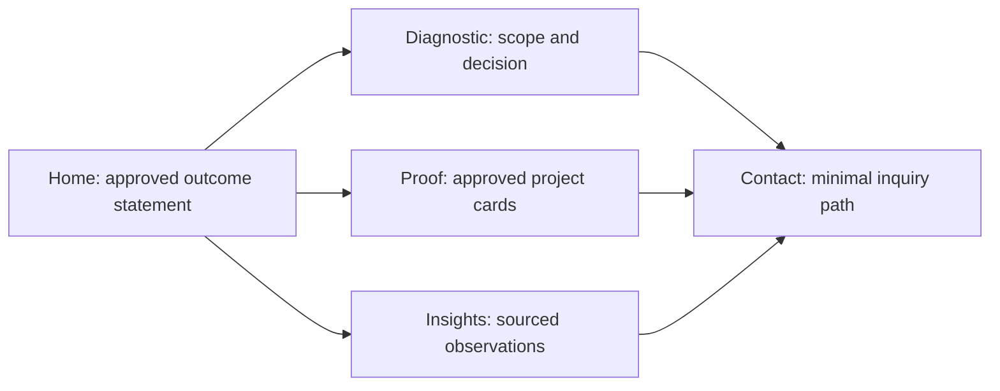

# Stage 0 design plan — public static authority site · 2026-09

- **Status:** proposed. No public copy is approved by this document.
- **Goal:** turn only owner-approved, public-safe evidence into a clear route to the paid diagnostic.
- **Inputs:** [B2B execution plan](https://github.com/AbleVarghese/Consult-Able/blob/Portfolio-consult/docs/strategy/B2B-CONSULTING-GROWTH-EXECUTION-PLAN-2026-09.md) · [public-claim approval pack](https://github.com/AbleVarghese/Consult-Able/blob/Portfolio-consult/docs/strategy/PUBLIC-CLAIM-APPROVAL-PACK-2026-09.md) · [open decisions](https://github.com/AbleVarghese/Consult-Able/blob/Portfolio-consult/docs/OPEN-DECISIONS-REGISTER.md).

## Page flow

| Surface | Visitor question | Required content | Explicit exclusion |
|---|---|---|---|
| Home | Is this relevant? | One approved P1 outcome statement, one route to the diagnostic, no unverifiable metrics | Broad service catalogue, biography claims, or financial claims |
| Diagnostic | What will happen? | Approved P2 scope, deliverables, suitable/unsuitable cases, no-go outcome | Free discovery disguised as a sale or invented ROI |
| Proof | Why trust this? | Up to three approved proof cards with current public links and review dates | Employer/client information, logos, metrics, or status claims without permission |
| Insights | Is the work thoughtful? | Source-linked operating observations and clear author/date | Generic trend content or automated content volume |
| Contact/privacy | What happens to my information? | Purpose, minimum fields, response expectation, no marketing-list default | Uploads, accounts, invasive profiling, or implied consent |

## Design system boundaries

| Area | Rule | Evidence before release |
|---|---|---|
| Hierarchy | One dominant diagnostic route; Hire/Build remain secondary | Owner confirms intended visitor priority |
| Language | Use approved sentences verbatim; label unapproved preview copy | OD-01 through OD-05 closure records |
| Accessibility | Keyboard-visible focus, semantic headings, labelled fields, errors announced, reduced motion respected | Measured keyboard, screen-reader, contrast, and form-error checks |
| Performance | Static-first assets, explicit image dimensions, no analytics/runtime by default | Real browser/lab evidence; no declared green from absence of errors |
| Privacy | No contact data beyond the approved inquiry purpose | Final form data map and failure-path review |

## Design approval gate

1. Owner approves the exact home/diagnostic/proof words.
2. Every visible project link has a current status, owner relationship, disclosure approval, and review date.
3. Contact fields and retention purpose are specified before a form appears.
4. A desktop and narrow-mobile review checks reading order, text wrapping, target size, keyboard flow, and reduced motion.
5. No blocked claim family from the approval pack appears in source, metadata, structured data, or visible copy.

**Stop condition:** a missing approval or proof-card field removes that item from the first release; it does not become placeholder marketing.
