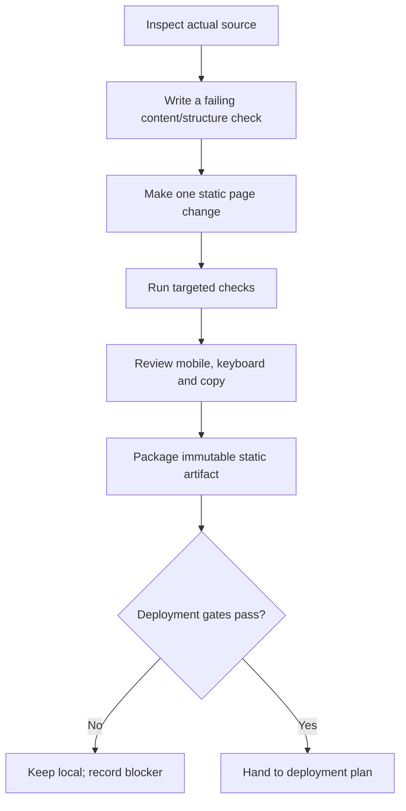

# Stage 0 implementation plan — static source only · 2026-09

- **Status:** proposed and blocked on the actual site worktree/branch inspection. No application source is changed here.
- **Goal:** make the smallest reversible static-site change that carries only approved content and remains deployable behind the ADR-004 edge.
- **Authority:** [foundation architecture](../architecture/FOUNDATION-ARCHITECTURE-PLAN-2026-09.md) §Next steps · [ADR-004](../decisions/ADR-004-self-hosted-authority-platform-2026-09.md) · [design plan](STAGE-0-DESIGN-PLAN-2026-09.md).

## Preconditions

| Gate | Required observation | Stop if absent |
|---|---|---|
| Canonical source | Actual `AbleVarghese/AbleVarghese.github.io` worktree, branch, build path, and existing checks are inspected | Do not infer a framework or write into this planning repository |
| Approved copy | OD-01 through OD-05 records close the relevant claim rows | Use no draft wording in a release candidate |
| Static boundary | No account, upload, scheduling, analytics, CRM, or database requirement | Escalate to the Stage 1 decision gate, not a Stage 0 workaround |
| Hosting readiness | OD-06 and OD-07 plus ADR-004 operational evidence | Keep changes local; do not deploy |

## Smallest implementation sequence

| Work package | Minimal output | Acceptance condition |
|---|---|---|
| Source reconnaissance | Measured page/assets/build/hosting map | All existing entry points and checks named; no framework assumed |
| Content change | One approved home/diagnostic/proof/contact slice | Only approved copy and links are added; blocked claims absent |
| Contact path | Either no form, or a data-minimal approved path | Purpose, validation, error state, retention owner, and privacy words match behavior |
| Static packaging | Immutable directory/archive plus content hash | Asset list, hash, host, and version are recorded before release |
| Documentation | Source-repo README/runbook updates | A later operator can reproduce local build, verification, and rollback input |

## Non-goals

- No visitor accounts, authentication, database, CMS, search, chatbot, file upload, payment, appointment workflow, or private portal.
- No framework, package, CI provider, deployment console, DNS record, certificate, container, or service is adopted by this plan.
- No source/destination migration occurs until the original static source and intended deployment path are verified.

## Completion evidence

The source-repository change is ready for deployment planning only when its observed RED/GREEN checks, source revision, static-artifact hash, accessibility review, approved-copy receipt, and rollback input all exist. A successful local render alone is not enough.
