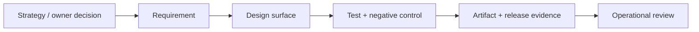

# Stage 0 product, requirements, and governance plan · 2026-09

- **Status:** proposed. It creates decision and traceability controls; it authorizes no public content or source change.
- **Goal:** convert the strategy into a bounded, owner-approved static-site release rather than a vague website project.
- **Inputs:** [strategy](https://github.com/AbleVarghese/Consult-Able/blob/Portfolio-consult/docs/strategy/B2B-CONSULTING-GROWTH-EXECUTION-PLAN-2026-09.md) · [design plan](STAGE-0-DESIGN-PLAN-2026-09.md) · [open decisions](https://github.com/AbleVarghese/Consult-Able/blob/Portfolio-consult/docs/OPEN-DECISIONS-REGISTER.md).

## Roles and decision rights

| Role | Accountable for | Cannot decide alone |
|---|---|---|
| Owner | Public wording, proof permission, commercial fit, DNS/certificate boundary, release authorization | Claims unsupported by evidence or operational gates not met |
| Builder | Source reconnaissance, smallest implementation, test evidence, artifact manifest | Public copy, deployment, credential scope, or scope expansion |
| Independent reviewer | Evidence/claim boundary, security/privacy/accessibility/release challenge | Replacing the owner’s approval |
| Estate operator | Mini/edge capacity, backup/recovery, host and network changes | Public content or commercial claims |
| Qualified specialist | Jurisdiction-specific legal, privacy, financial, or accessibility advice when required | Product direction absent the owner |

## Requirement register

| ID | Requirement | Source | Acceptance evidence | Non-goal / failure condition |
|---|---|---|---|---|
| R-01 | The first release is static, account-free, and data-minimal | ADR-004 | Source inventory and served-path check show no account/database/private portal | Any protected workflow routes to Stage 1 decision gate |
| R-02 | Every public claim is owner-approved and evidence-bounded | Approval pack | Exact wording approval + proof-card review date | Unsupported/employer/financial/customer/metric claim blocks release |
| R-03 | One dominant route leads to the paid diagnostic | B2B strategy | Navigation/content check and owner review | Equal-weight service catalogue or unqualified free-discovery path |
| R-04 | The site is usable by keyboard and supports readable narrow/mobile layouts | Design/verification plans | Keyboard, heading, form, contrast, target-size, reduced-motion review | Missing labels/focus or inaccessible interaction blocks release |
| R-05 | Any inquiry path states purpose and minimizes fields | Approval pack | Data inventory, field list, privacy copy, failure-path evidence | Hidden marketing default, uploads, or undefined retention blocks release |
| R-06 | The deployed artifact is identifiable and reversible | CI/CD/deployment plans | Source revision, artifact digest, release record, rollback read-back | Working-tree deploy or absent prior artifact blocks release |

## Traceability contract

For every source-repository change, the release record must name `requirement ID → source file/component → targeted test → candidate artifact digest → post-release check`. A new requirement may not enter a release through a “small copy tweak” exception.

## Milestones and exit gates

| Milestone | Entry | Exit |
|---|---|---|
| M0 — discovery | This plan and open decisions exist | Actual site worktree/branch/build path and existing checks measured |
| M1 — approved scope | M0 evidence exists | Relevant OD rows close; each release item maps to R-01–R-06 or a newly approved requirement |
| M2 — candidate | M1 complete | Observed RED/GREEN, accessibility/privacy review, and immutable artifact digest |
| M3 — operational readiness | M2 complete | Mini/edge/recovery/release-control gates pass independently |
| M4 — controlled release | M3 complete | Owner authorizes one candidate; post-release/rollback evidence recorded |
| M5 — review | Release exists | Outcome, incident, content freshness, and next decision recorded |

## Change and risk control

| Event | Required action |
|---|---|
| New page, claim, form field, dependency, host, metric, or integration | Classify it against R-01–R-06; add/alter requirement, test, risk, and approval before implementation |
| Material assumption disproved | Mark affected decision `UNVERIFIED`, stop dependent release work, and re-open the relevant ADR/OD row |
| Scope exceeds static/no-account boundary | Stop Stage 0 work and define the Stage 1 workflow/actor/data/authorization decision first |
| Emergency public defect | Preserve evidence, make the smallest reversible correction, record the change, and run the post-change review |

**Definition of ready:** owner decision, requirement, acceptance evidence, owner, risk/rollback, and test approach are known.
**Definition of done:** functional, negative, integration, persistence, observable, reversible, documented, and owned evidence is recorded where applicable; inapplicable dimensions are explicitly named.
