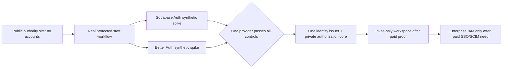

# Foundation architecture and OSS identity research — 2026-09

- **Status:** Evidence screen complete for the bounded eight-repository field; adoption remains blocked pending a real website-repository spike.
- **Purpose:** identify the smallest well-established open-source building blocks for identity, protected operations, and future integrations without recreating generic systems.
- **Collection authority:** [foundation collection admission](foundation-architecture-collection-admission-2026-09.md).

## Research overlap

**INDEX checked; overlaps** [CRM/ERP/admin landscape](crm-erp-admin-portal-landscape-2026-09.md) and [consulting-growth research](consulting-growth-plan-research-2026-09.md) on canonical operations data, intake, privacy, and the current Supabase proposal. **Extension only:** this study screens identity/authentication repositories, own-project patterns, and integration boundaries; it does not re-score CRM/ERP products.

## Evidence method and limits

| Item | Boundary |
|---|---|
| Candidate field | Eight named repositories, selected to represent embedded TypeScript auth, data-core auth, proxy/perimeter auth, and full identity platforms |
| Primary sources | GitHub repository metadata, direct license file, README, current release, workflows, community profile, `SECURITY.md`, and Dependabot file where the bounded endpoint returned one |
| Local prior art | Read-only manifests/configuration/migration pointers in Keralora and LawyerServed; source observation only, no runtime dependence |
| Service screen | Two Stripe Directory queries for authentication/PostgreSQL; no service was provisioned, contacted, or selected |
| Excluded actions | No package install, clone, source execution, account creation, deployment, private-repository access, credential use, or provider authentication |
| Honest limit | This is an admission screen, not a penetration test, code audit, live load test, or legal review. Missing `SECURITY.md`/Dependabot endpoint data is `UNKNOWN`, not a security failure or a clean bill of health. |

All raw source responses, excerpts, hashes, and retrieval statuses are preserved in [`foundation-architecture-evidence-2026-09/`](foundation-architecture-evidence-2026-09/).

## Current evidence

### Candidate screen

| Candidate | License | Observed evidence | Architecture fit | Disposition |
|---|---|---|---|---|
| `supabase/auth` | MIT | Go service; README states JWT issuance and RLS/PostgREST support; v2.197.0 release evidence | Direct fit with the proposed PostgreSQL/Supabase core | First synthetic spike candidate |
| `better-auth/better-auth` | MIT | TypeScript framework; v1.7.5; root security policy and Dependabot configuration returned | Strong direct TypeScript fit; needs a database-authorization integration proof | Second synthetic spike candidate |
| `nextauthjs/next-auth` | ISC | README explicitly recommends Better Auth for new projects except stateless-session gaps | Duplicates the Better Auth route for the stated default | Do not start a new route |
| `authelia/authelia` | Apache-2.0 | Reverse-proxy SSO/MFA server; v4.39.28; root security policy returned | Strong operator/perimeter candidate, weak default fit for application-owned customer identity | Defer as perimeter-only reference |
| `ory/kratos` | Apache-2.0 | API-first identity server; v26.2.0; README describes Hydra plus Kratos for OAuth/OIDC provider capabilities | Correct only when enterprise/federated identity becomes a real paid need | Defer |
| `keycloak/keycloak` | Apache-2.0 | Java identity/access platform; v26.7.4; root security policy and Dependabot configuration returned | Mature but carries a separate, broad identity runtime | Defer |
| `zitadel/zitadel` | AGPL-3.0 | Full identity platform; v4.19.1; root policy/dependabot returned | License fails the default adoption gate | Exclude |
| `logto-io/logto` | MPL-2.0 | TypeScript identity infrastructure; v1.43.0 | License is outside the current explicit permitted list | Not admitted without a separate owner decision |

### Direct-source findings that changed the recommendation

1. **Supabase Auth is not a casual self-host.** Its README says production self-hosting is not easy and recommends Supabase Auth for regular security updates. This preserves a decision between managed service and self-hosted operation; it does not authorize either.
2. **Better Auth is a real, active fallback—not an assumed improvement.** It is MIT, TypeScript-native, has a security reporting policy, and appears in the current Keralora application manifest. Its fit with the private command/RLS design is still unproven.
3. **Auth.js itself recommends Better Auth for new projects.** This eliminates a redundant route rather than adding another near-identical comparison.
4. **Full identity platforms solve a future problem.** Ory’s documented Kratos/Hydra pairing and Keycloak’s separate Java platform make sense for enterprise federation, not the present public-first/founder-stage scope.
5. **Authelia is a different shape.** It documents reverse-proxy protection and SSO/MFA; the current owner template is single-operator, local-SQLite, no-email-reset configuration. It is a useful internal gateway pattern, not proof of a client-workspace identity solution.

### Local owner-project patterns

| Source | Observed fact | Reuse boundary |
|---|---|---|
| Keralora `apps/web/package.json` | `better-auth` and `@better-auth/expo` are direct dependencies at `1.6.25` | Source pattern only; upstream currently reports `1.7.5`, so do not copy/version-pin without a fresh compatibility and security review |
| Keralora migrations `0005`/`0006` | A schema-privilege issue was handled through tightly scoped `SECURITY DEFINER` wrappers with a pinned search path | Reuse the lesson—privileged paths need explicit scope and tests—not the exact database role names or migrations |
| LawyerServed web manifest + RLS migration | Uses Supabase client packages and database RLS policy patterns; has a mutation-coverage script | Reuse the negative-control concept only; the working tree had 49 uncommitted changes when inspected, so it is not a safe direct dependency source |
| Scrapos Authelia template | Documents file-based secrets, Argon2id, one-factor default, retry regulation, and isolated SQLite state | Configuration comments report prior validation, but this study did not run it; treat as a reference, not a certified deployment |

### Managed-service comparison

| Directory result | Meaning | Current decision |
|---|---|---|
| Supabase | Directory describes PostgreSQL, Authentication, APIs, storage, and related platform capabilities | Candidate only; identity-data transfer/provisioning needs specific owner approval |
| Clerk, WorkOS, Auth0 | Directory surfaced managed identity/user-management paths | Not selected: managed data flow is outside the owner-first default |
| Neon | Directory surfaced managed PostgreSQL | Separate database alternative, not an identity decision |

## Foundation recommendation

The best current result is a **staged composition**, not a new identity system:

- **Initial candidate:** Supabase Auth, conditioned on the real platform retaining a Supabase/PostgreSQL core.
- **Fallback candidate:** Better Auth, conditioned on passing identical actor/session/authorization controls.
- **Non-negotiable boundary:** identity proves a sign-in; the private command/database layer decides what the actor can do.
- **No premature abstraction:** preserve a stable internal actor contract now. Add a provider adapter only when the second candidate is actually exercised.
- **No parallel account truth:** exactly one issuer after selection.

The deterministic matrix gives the staged route a score of **9.23**, but only a **62.0%** simulation win rate; direct Supabase Auth wins **32.7%**. The decision is therefore `FRAGILE`, and the cheapest discriminating test is mandatory.

## Required repository admission before adoption

1. Re-read the direct license file and current SPDX at the exact pinned release.
2. Inspect the selected release’s transitive dependencies/advisories locally; do not rely on repository popularity or badges.
3. Run the actual provider in an isolated synthetic-data environment; execute session, revocation, MFA-assurance, account-link, authorization, raw-mutation, and outage negative controls.
4. Prove upgrade, rollback, and migration behavior before a customer or staff identity enters the system.
5. Record provider, version, license, operating owner, recovery method, and egress/data classification in the actual website repository.

## Unknowns and stop conditions

| Unknown | Why it matters | What settles it |
|---|---|---|
| Actual website stack | Determines whether the Supabase/Auth architecture fits at all | Identify the future website repository and manifest |
| Managed versus self-hosted identity | Changes data egress, operations, recovery, and upgrade ownership | Owner-approved data/egress decision after the spike |
| Need for client accounts | Could be a speculative portal feature | Repeated paid-workspace friction and named client need |
| Enterprise SSO/SCIM | Determines whether Ory/Keycloak class systems are justified | Signed/paid customer requirement and operations budget |
| Legal/privacy classification | Changes retention, consent, data residency, and identity recovery requirements | Jurisdiction/product review before real identity data is collected |

Stop rather than workaround if a provider needs broad client credentials, direct protected-table mutation, hidden account linking, an unapproved data transfer, an incompatible license, or a second authoritative operations store.
