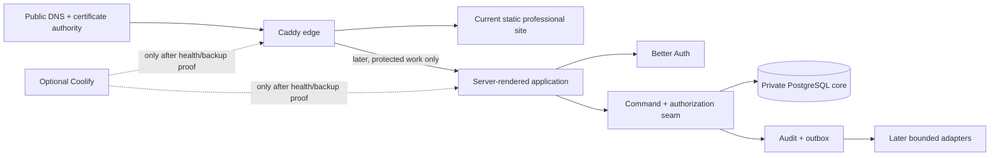

# Self-hosted authority-platform research — 2026-09

- **Status:** bounded source screen complete; deployment and package adoption remain blocked.
- **Purpose:** choose an open-source, owner-operated path for the current professional site and a later protected operations surface without adopting managed application, database, or identity services.
- **Collection contract:** [admission record](self-hosted-authority-platform-collection-admission-2026-09.md). **INDEX checked:** this extends the prior identity and admin research with self-host operation, current-site discovery, and deployment topology; it does not re-score CRM/ERP products.

## 1. What actually exists

| Surface | Direct observation | Consequence |
|---|---|---|
| Current planning repository | Strategy/evidence files only; no app manifest, Compose file, or latest résumé; owner-provided `sources/2026-09/private/linkedin-profile-owner-provided-2026-09.pdf` arrived after the original inventory | It is a decision corpus, not the deployable site repository; the PDF is a bounded professional-evidence source |
| Owner site repository | `AbleVarghese/AbleVarghese.github.io`, public, active, branch `main`; root has `index.html` and `assets/` | This is the only bounded owner-repository match for portfolio/website terms |
| Current site implementation | Static HTML, 13,948 bytes, no form, no external script, no Node/Docker manifest | It can be hosted before any account, database, or application runtime exists |
| Mac mini | Tailscale reports the peer online; one SSH capacity probe timed out | Runtime headroom, running services, backups, and deployment readiness are `UNVERIFIED` |

The supplied package reinforces the distinction: its README names `Able_Varghese_Resume_sept2026(1).docx` as the primary professional source, while the bounded repository inventory still does not contain that file. An owner-provided `sources/2026-09/private/linkedin-profile-owner-provided-2026-09.pdf` now supplies a bounded local profile source; its claim map is separate because it is not independent résumé/employer proof. The strategy/evidence workbook is useful source material; it is not the missing primary evidence.

## 2. Source-screened building blocks

| Building block | Direct source evidence | Role | Decision |
|---|---|---|---|
| PostgreSQL | `COPYRIGHT` directly grants permission to use, copy, modify, and distribute; GitHub’s SPDX field is `NOASSERTION` | Canonical relational data store, later only | **Conditional**: classify the direct PostgreSQL license against the owner policy before pinning a new version |
| Caddy | Apache-2.0; README: “an extensible server platform that uses TLS by default” | Edge proxy and public static-site host | **Stage 0 candidate** |
| Better Auth | MIT; framework-agnostic TypeScript authentication/authorization framework; root contains security policy, workflows, tests, and a Compose file | Embedded sign-in module for the future app | **Stage 1 candidate** |
| Next.js | MIT; README describes full-stack web applications | Future server-rendered application runtime | **Conditional**: use only after the protected-workflow spike proves the runtime path |
| Drizzle ORM | Apache-2.0; README describes typed SQL plus migration generation/application | Explicit schema/migration seam | **Stage 1 candidate** |
| Coolify | Apache-2.0; README says it deploys apps/databases/services on owner servers and can deploy Docker Compose | Optional deployment control plane | **Optional**: only after its live health, backup, and recovery evidence exists |
| Supabase | Apache-2.0; README says it can self-host and bundles database, auth, generated APIs, realtime, storage, and dashboard capabilities | Full-platform alternative | **Deferred**: more capability and operations than current evidence requires |
| Umami | MIT; README supports self-hosted Docker/Compose with PostgreSQL | First-party analytics option | **Deferred**: no measurement owner requires it yet |

All source receipts are preserved under [`self-hosted-authority-platform-evidence-2026-09/`](self-hosted-authority-platform-evidence-2026-09/). The collection attempted 64 bounded endpoints: 58 returned source material and 6 returned an explicit unavailable state. An unavailable security-policy endpoint is an unknown, never a clean security result.

## 3. Recommended topology: staged direct self-hosting

### Stage 0 — public proof

1. Host the existing static site directly behind Caddy.
2. Keep it account-free: no uploads, booking, analytics, public assistant, CRM, or email workflow.
3. Preserve the evidence gate: public claims still need an approved source, regardless of where the HTML is hosted.
4. Treat GitHub Pages as the current source-hosting status quo, not the target production host.

### Stage 1 — protected owner/staff operations

Only after a real protected workflow exists, add one source-controlled Compose topology:

| Module | Owns | Explicit limit |
|---|---|---|
| Application | Page rendering and named server commands | No privileged database access in browser code |
| Better Auth | Sign-in session and provider subject | No business authorization or email-based account merging |
| PostgreSQL | Private canonical operational/evidence state | No broad browser `INSERT`/`UPDATE`/`DELETE` rights |
| Drizzle | Explicit schema and migration delivery | No hidden schema mutation outside a reviewed migration |
| Caddy | TLS termination and routing | No business authorization decision |
| Audit/outbox | Immutable action history and provider-delivery intent | No direct third-party write to core tables |

The stable `actor_id` contract from ADR-003 remains: identity proves sign-in; the database-command seam decides scope, grant, revocation, and business authorization.

### Explicit non-goals

- No full self-hosted Supabase stack unless a measured need requires its realtime, storage, generated-API, or dashboard capability.
- No Keycloak or Ory until a paid enterprise federation, SAML, SCIM, or cross-product identity requirement exists.
- No Coolify dependence. It can become a deployment adapter after live proof; the Compose topology remains the portable source of truth.
- No self-hosted email server, scheduling system, analytics platform, object storage, or search engine before a named workflow demonstrates value.

## 4. Why this wins

The direct composition scores **9.10** in the locked matrix, wins **93.7%** of 10,000 sensitivity worlds, and has the lowest maximum regret (**0.400**). The runner-up is the same lean stack deployed through Coolify (**8.25**), which becomes viable only after the currently unreachable server passes health, resource, backup, and restore checks. Matrix evidence: [`self-hosted-authority-platform-matrix-2026-09.output.txt`](../decisions/self-hosted-authority-platform-matrix-2026-09.output.txt).

This result does not claim that the stack works. It chooses the smallest architecture worth proving. The private-core, direct-mutation, lock-version, audit, outbox, MFA, revocation, and recovery controls from ADR-002/003 remain promotion gates.

## 5. Constraints that prevent a false “fully independent” claim

| Dependency | Why it remains | Boundary |
|---|---|---|
| DNS | Public visitors need a route to the owner server | Domain/control-plane decision stays with the owner |
| Public certificate authority | Browser-trusted public HTTPS needs an external trust anchor | Use only for certificate issuance; no application or identity data is delegated |
| Internet/email recipients | An eventual email reply crosses recipient infrastructure even with a self-hosted sender | Keep email out of Stage 0; decide it separately when needed |
| Mac mini availability | One physical host is a single failure domain | No launch until encrypted backup, restore drill, monitoring, and a documented outage posture exist |

If “no managed services” also forbids public DNS and public certificate authorities, the site must be private-network-only or browsers will receive untrusted certificates. This is an explicit assumption, not a hidden exception.

## 6. Mandatory proof before any launch

| Gate | Positive proof | Negative proof |
|---|---|---|
| Mini access | SSH read-only health and capacity snapshot completes | Timeout/ACL failure is visible and blocks deployment |
| Restore | A synthetic PostgreSQL backup restores into an isolated database and passes a read-back | Corrupt/missing backup alerts and refuses promotion |
| Static edge | Caddy serves the exact pinned static artifact through HTTPS | Bad host, expired certificate, and missing artifact fail loudly |
| Private core | Named command changes one synthetic record with audit/outbox evidence | Authenticated raw protected-table/API write returns `401`/`403` |
| Identity | Allowlisted MFA session maps to one actor | Expired, revoked, wrong-issuer, and same-email/different-subject paths fail closed |
| Operations | Resource limits and health checks preserve database availability under an app restart | Container/resource exhaustion produces a visible stop condition |

## 7. Open items

1. Restore SSH access to the Mac mini and obtain a fresh, read-only capacity/backup snapshot.
2. Classify PostgreSQL’s direct license text under the owner’s permissive-license policy before a new pin/adoption record.
3. Locate the actual latest résumé; `sources/2026-09/private/linkedin-profile-owner-provided-2026-09.pdf` is available locally and recorded in the professional-evidence reconciliation.
4. Confirm whether public DNS/certificate authority use is acceptable under the no-managed-services requirement.
